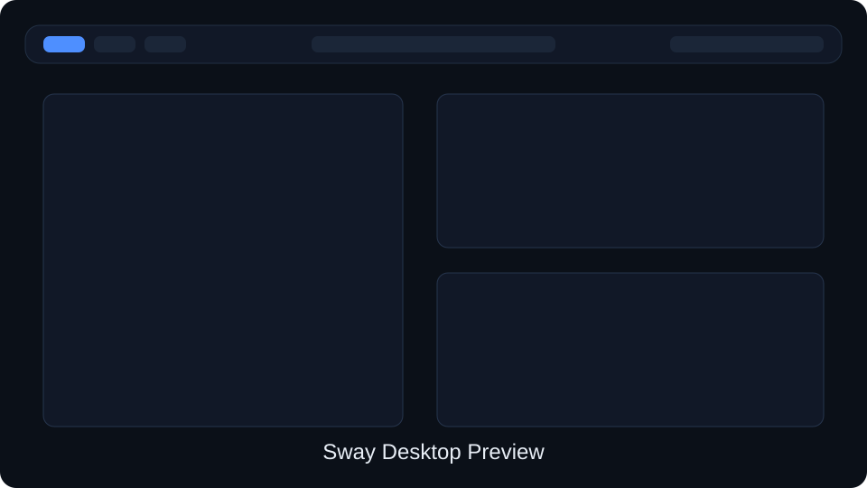
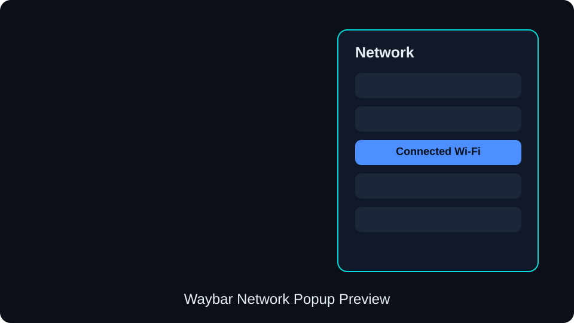
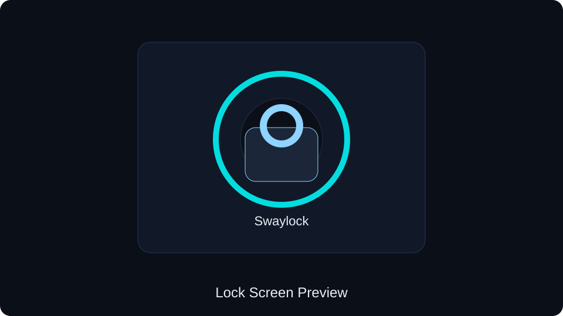

# Sway Dotfiles


A clean Sway desktop configuration for a fast Wayland workflow. This setup includes Sway, Waybar, Mako, Swaylock, MIME defaults, screenshot shortcuts, and a macOS-style Wi-Fi popup with a native GTK toggle switch, driven directly by NetworkManager (no polling).

## Preview

The images below are visible placeholders. Replace them with real screenshots or GIFs when you record your setup.

| Desktop | Network Popup |
| --- | --- |
|  |  |

| Lock Screen | Notifications |
| --- | --- |
|  |  |

## Features

- Sway configuration with `Mod4` keybindings and Vim-style focus movement.
- Optional SwayFX support (rounded corners, blur, shadows) - `swayfx.conf` is only loaded when the swayfx binary is actually installed, so plain sway still works.
- Waybar top panel with workspaces, active window title, tray, audio, network, CPU, memory, and clock modules.
- macOS-style Wi-Fi popup (`waybar/wifi-popup/`): GTK3 + libnm, native toggle switch, Known/Other Networks sections, inline password prompt, right-click to forget a saved network. Fully signal-driven off NetworkManager's own D-Bus events, not polling. A Wofi/`nmcli` fallback popup is kept in `waybar/scripts/network-popup.sh`.
- Searchable keybindings cheat sheet on `Mod + h` (reads this repo's own `sway/config` and greps every `bindsym`).
- Mako notification styling with translucent dark colors and accent borders.
- Swaylock theme with image background and visible lock states.
- MIME defaults for Firefox, MPV, Dolphin, and IMV.
- Screenshot bindings using `grim`, `slurp`, and `wl-copy`.

## Project Structure

```text
sway/
├── README.md
├── LICENSE
├── sway/
│   ├── config
│   ├── swayfx.conf          # corner_radius/blur/shadows - only used if swayfx is installed
│   ├── idle.sh
│   ├── lock.sh
│   └── show_keybindings.sh  # Mod+h searchable keybindings popup
├── waybar/
│   ├── config
│   ├── style.css
│   ├── network-popup.css
│   ├── scripts/
│   │   └── network-popup.sh   # fallback Wofi/nmcli popup
│   └── wifi-popup/            # macOS-style GTK Wi-Fi popup (default on-click)
│       ├── wifi_popup.py
│       ├── ui.py
│       ├── network.py
│       ├── animations.py
│       ├── config.py
│       └── styles.css
├── assets/
│   └── preview/
│       ├── desktop.svg
│       ├── desktop.png
│       ├── network-popup.svg
│       ├── network-popup.png
│       ├── lockscreen.svg
│       ├── lockscreen.png
│       ├── notifications.svg
│       └── notifications.png
├── mako/
│   └── config
├── swaylock/
│   └── config
└── applications/
    ├── mimeapps.list
    └── imv-image-viewer.desktop
```

## Requirements

Install the core packages before applying the configuration.

### Arch Linux

```bash
sudo pacman -S --needed \
  sway waybar mako swaylock swayidle \
  kitty wofi firefox dolphin thunderbird code discord \
  networkmanager nm-connection-editor \
  pipewire pipewire-pulse pavucontrol \
  brightnessctl grim slurp wl-clipboard cliphist jq \
  imv mpv ttf-jetbrains-mono-nerd \
  python-gobject gtk-layer-shell libnm
```

`python-gobject`, `gtk-layer-shell`, and `libnm` are only needed for the Wi-Fi popup (`waybar/wifi-popup/`). `swayfx` itself is AUR-only and optional - `sway/swayfx.conf` is simply skipped if it isn't installed.

### Fedora

```bash
sudo dnf install \
  sway waybar mako swaylock swayidle \
  kitty wofi firefox dolphin thunderbird code discord \
  NetworkManager-applet nm-connection-editor \
  pavucontrol brightnessctl grim slurp wl-clipboard cliphist \
  imv mpv jetbrains-mono-fonts-all
```

Some package names can differ by distribution. Make sure `NetworkManager`, `PipeWire`, and your display manager or TTY session are set up for Wayland.

## Installation

Clone the repository:

```bash
git clone https://github.com/ravindran-dev/sway.git
cd sway
```

Back up your existing configuration:

```bash
mkdir -p ~/.config-backup
cp -r ~/.config/sway ~/.config-backup/sway 2>/dev/null || true
cp -r ~/.config/waybar ~/.config-backup/waybar 2>/dev/null || true
cp -r ~/.config/mako ~/.config-backup/mako 2>/dev/null || true
cp -r ~/.config/swaylock ~/.config-backup/swaylock 2>/dev/null || true
cp ~/.config/mimeapps.list ~/.config-backup/mimeapps.list 2>/dev/null || true
```

Copy the dotfiles:

```bash
mkdir -p ~/.config
cp -r sway waybar mako swaylock ~/.config/
cp applications/mimeapps.list ~/.config/mimeapps.list
mkdir -p ~/.local/share/applications
cp applications/imv-image-viewer.desktop ~/.local/share/applications/
chmod +x ~/.config/waybar/scripts/network-popup.sh
```

Reload Sway:

```bash
swaymsg reload
```

Restart Waybar if needed:

```bash
pkill -x waybar
waybar -c ~/.config/waybar/config -s ~/.config/waybar/style.css
```

## Important Paths

The current config references local files under `/home/ravi`:

```text
/home/ravi/Pictures/wallpaper.png
/home/ravi/Pictures/iron.png
/home/ravi/.config/waybar/config
/home/ravi/.config/waybar/style.css
/home/ravi/.config/swaylock/config
```

If your username or wallpaper paths are different, update these files:

```bash
nvim ~/.config/sway/config
nvim ~/.config/swaylock/config
```

## Keybindings

| Binding | Action |
| --- | --- |
| `Mod + Return` | Open Kitty |
| `Mod + d` | Open Wofi launcher |
| `Mod + q` | Close focused window |
| `Mod + Shift + c` | Reload Sway |
| `Mod + Shift + e` | Exit Sway |
| `Mod + Left/j/k/l` | Move focus (left/down/up/right) |
| `Mod + Shift + Left/j/k/l` | Move window |
| `Mod + 1..5` | Switch workspace |
| `Mod + Shift + 1..5` | Move window to workspace |
| `Mod + f` | Toggle fullscreen |
| `Mod + v` | Split vertical |
| `Mod + Shift + b` | Split horizontal |
| `Mod + s` | Stacking layout |
| `Mod + w` | Tabbed layout |
| `Mod + Shift + Space` | Toggle floating |
| `Mod + h` | Searchable keybindings popup |
| `Print` | Full screenshot |
| `Shift + Print` | Area screenshot |
| `Ctrl + Print` | Copy area screenshot |
| `Mod + Shift + s` | Area screenshot: save + copy to clipboard |
| `Mod + b` | Open Firefox |
| `Mod + e` | Open Dolphin |
| `Mod + Shift + m` | Open Thunderbird |
| `Mod + Shift + v` | Open VS Code |
| `Mod + Shift + d` | Open Discord |

## Wi-Fi Popup

Clicking the Waybar network module launches the macOS-style GTK popup:

```bash
python3 ~/.config/waybar/wifi-popup/wifi_popup.py
```

It reads NetworkManager directly through `libnm`'s GObject introspection binding and reacts to its D-Bus signals - there's no polling loop anywhere. Shows the connected network under "Known Network" with a checkmark, lists nearby APs under "Other Networks" with signal/lock icons, and has a real `Gtk.Switch` toggle for radio on/off. Right-click a known network to forget it; click one you're not on to connect (secured + not-yet-saved networks get an inline password prompt instead of failing silently). Clicking the module again, pressing `Escape`, or clicking anywhere else closes it.

The older Wofi/`nmcli` popup is still in the repo as a lighter-weight fallback:

```bash
~/.config/waybar/scripts/network-popup.sh
```

## Preview GIF Recording

Use `wf-recorder` to create the GIF source video:

```bash
mkdir -p assets/preview
wf-recorder -f /tmp/sway-preview.mp4
```

Convert it to a GIF:

```bash
ffmpeg -i /tmp/sway-preview.mp4 \
  -vf "fps=15,scale=1280:-1:flags=lanczos" \
  assets/preview/desktop.gif
```

Record focused previews for:

```text
assets/preview/desktop.gif
assets/preview/network-popup.gif
assets/preview/lockscreen.gif
assets/preview/notifications.gif
```

After recording real GIFs, update the preview image paths in this README from `.png` to `.gif`.

## Troubleshooting

Check Sway configuration:

```bash
sway -C -c ~/.config/sway/config
```

Check Waybar directly:

```bash
waybar -l trace -c ~/.config/waybar/config -s ~/.config/waybar/style.css
```

Check Mako:

```bash
makoctl mode
notify-send "Mako" "Notification test"
```

Check Swaylock:

```bash
swaylock -f -C ~/.config/swaylock/config
```

Check MIME defaults:

```bash
xdg-mime query default image/png
xdg-mime query default video/mp4
xdg-mime query default text/html
```

##  Author - **Ravindran S** 


Developer • ML Enthusiast • Neovim Customizer • Linux Power User  

Hi! I'm **Ravindran S**, an engineering student passionate about:

-  Linux & System Engineering  
-  AIML (Artificial Intelligence & Machine Learning)  
-  Full-stack Web Development  
-  Hackathon-grade project development  

R NVIM is my personal Neovim distribution - built to be fast, beautiful, and productive.


## 🔗 Connect With Me

You can reach me here:

###  **Socials**
<a href="www.linkedin.com/in/ravindran-s-982702327" target="_blank">
  
</a>


<a href="https://github.com/ravindran-dev" target="_blank">
  
</a>


###  **Contact**
<a href="mailto:ravindrans.dev@gmail.com" target="_blank">
  
</a>


## License

This project is licensed under the [MIT License](LICENSE).
